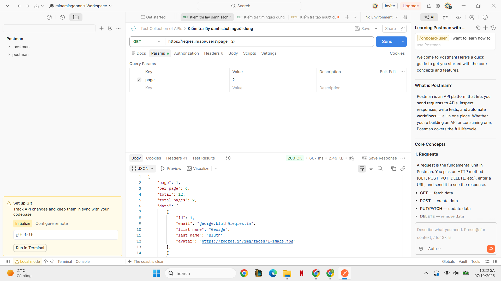
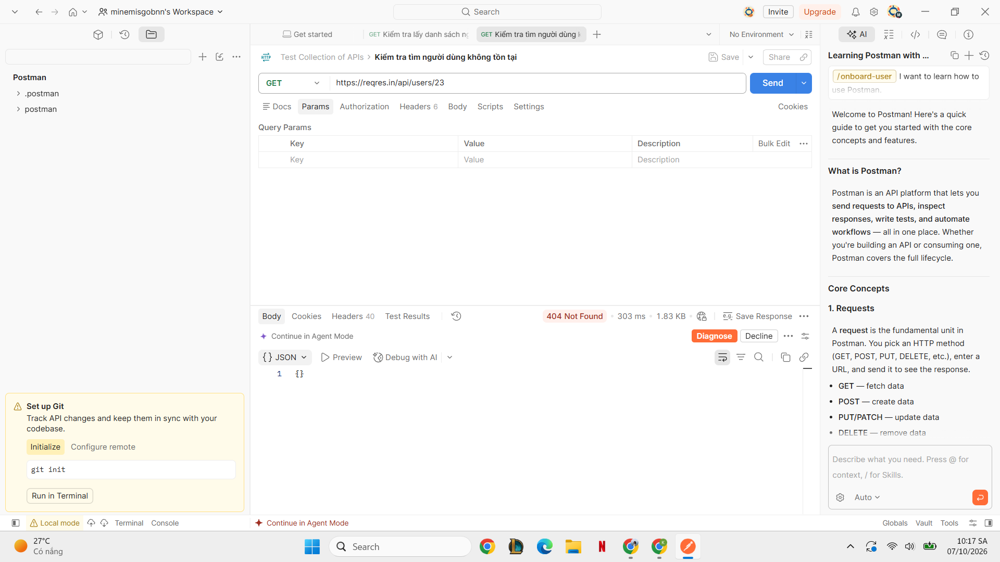
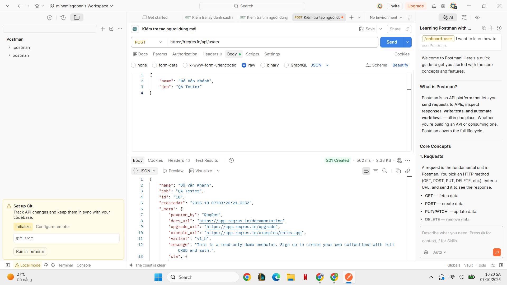

**Tên dự án:** Test Collection of APIs

**Ngày kiểm tra:** 07/10/2026

**Người kiểm tra:** Đỗ Vân Khánh


**1. Kiểm tra mục tiêu:** Sử dụng Postman để kiểm tra thực tế API

**2. Môi trường kiểm tra thử nghiệm:** Phần mềm Postman.

**3. Phương pháp kiểm tra thử nghiệm:** Kiểm tra thử tự động và thủ công trên phần mềm Postman.

**4. Bản kiểm tra thử nghiệm lần 1:**

- Tên bản tin: Kiểm tra cơ sở của 1 URL

- Mục đích: Test khả năng hoạt động của URL và phần mềm Postman

- Phương thức HTTP (GET/POST/PUT/DELETE): GET

- URL: https://reqres.in/api/users

- Tham số: Không có

- Kết quả mong đợi: Gửi yêu cầu thành công

- Kết quả thực tế: Đã gửi yêu cầu thành công

- Trạng thái: Thành công

- Kết quả sau khi kiểm tra:
  

- Kết quả kiểm tra chi tiết:

```json
{
    "page": 1,
    "per_page": 6,
    "total": 12,
    "total_pages": 2,
    "data": [
        {
            "id": 1,
            "email": "george.bluth@reqres.in",
            "first_name": "George",
            "last_name": "Bluth",
            "avatar": "https://reqres.in/img/faces/1-image.jpg"
        },
        {
            "id": 2,
            "email": "janet.weaver@reqres.in",
            "first_name": "Janet",
            "last_name": "Weaver",
            "avatar": "https://reqres.in/img/faces/2-image.jpg"
        },
        {
            "id": 3,
            "email": "emma.wong@reqres.in",
            "first_name": "Emma",
            "last_name": "Wong",
            "avatar": "https://reqres.in/img/faces/3-image.jpg"
        },
        {
            "id": 4,
            "email": "eve.holt@reqres.in",
            "first_name": "Eve",
            "last_name": "Holt",
            "avatar": "https://reqres.in/img/faces/4-image.jpg"
        },
        {
            "id": 5,
            "email": "charles.morris@reqres.in",
            "first_name": "Charles",
            "last_name": "Morris",
            "avatar": "https://reqres.in/img/faces/5-image.jpg"
        },
        {
            "id": 6,
            "email": "tracey.ramos@reqres.in",
            "first_name": "Tracey",
            "last_name": "Ramos",
            "avatar": "https://reqres.in/img/faces/6-image.jpg"
        }
    ],
    "support": {
        "url": "https://benhowdle.im/first-cto-playbook?utm_source=reqres&utm_medium=json&utm_campaign=referral",
        "text": "Become a better CTO. A playbook of painful stories and practical advice from a two-time startup CTO."
    },
    "_meta": {
        "powered_by": "ReqRes",
        "docs_url": "https://app.reqres.in/documentation",
        "upgrade_url": "https://app.reqres.in/upgrade",
        "example_url": "https://app.reqres.in/examples/notes-app",
        "variant": "v1_b",
        "message": "This is a read-only demo endpoint. Sign up to create your own collections with full CRUD and auth.",
        "cta": {
            "label": "Get started",
            "url": "https://app.reqres.in/upgrade"
        },
        "context": "legacy_success"
    }
}
```


**5. Bản kiểm tra thử nghiệm lần 2:**

- Tên bản tin: Kiểm tra cơ sở của một URL với một tham số không tồn tại

- Mục đích: Test khả năng hoạt động của URL và phần mềm Postman

- Phương thức HTTP (GET/POST/PUT/DELETE): GET

- URL: https://reqres.in/api/users/23

- Tham số: Không có

- Kết quả mong đợi: Gửi yêu cầu thành công

- Kết quả thực tế: Gửi yêu cầu thất bại

- Trạng thái: Failed

- Kết quả sau khi kiểm tra:
     

- Kết quả kiểm tra chi tiết:

```json
{}
```


**6. Bản kiểm tra thử nghiệm lần 3:**

- Tên bản tin: Kiểm tra tạo mới một đối tượng dữ liệu

- Mục đích: Test khả năng gửi dữ liệu dạng JSON thông qua phương thức POST trên phần mềm Postman

- Phương thức HTTP (GET/POST/PUT/DELETE): POST

- URL: https://reqres.in/api/users

- Body (JSON):

```json
{
    "name": "Đỗ Vân Khánh",
    "job": "QA Tester"
}
```

- Kết quả mong đợi: Gửi yêu cầu thành công

- Kết quả thực tế: Đã gửi yêu cầu thành công

- Trạng thái: Thành công

- Kết quả sau khi kiểm tra:
   

- Kết quả kiểm tra chi tiết:

```json
{
    "name": "Đỗ Vân Khánh",
    "job": "QA Tester",
    "id": "18",
    "createdAt": "2026-10-07T03:20:21.033Z",
    "_meta": {
        "powered_by": "ReqRes",
        "docs_url": "https://app.reqres.in/documentation",
        "upgrade_url": "https://app.reqres.in/upgrade",
        "example_url": "https://app.reqres.in/examples/notes-app",
        "variant": "v1_b",
        "message": "This is a read-only demo endpoint. Sign up to create your own collections with full CRUD and auth.",
        "cta": {
            "label": "Get started",
            "url": "https://app.reqres.in/upgrade"
        },
        "context": "legacy_success"
    }
}
```


**7. Kết quả kiểm tra thử nghiệm:**

Tóm tắt thử nghiệm kiểm tra kết quả, bao gồm số lượng thử nghiệm kiểm tra, số lượng thành công, số lượng thất bại và tỷ lệ thành công.

- Đã kiểm tra số lượng script: 3

- Số lần thành công: 2

- Số lần thất bại: 1

- Tỷ lệ thành công: 66.7%


**8. Phát hiện lỗi:**

Chi tiết về lỗi, bao gồm:

- ID lỗi: 404 Not Found

- Mô tả lỗi: Trang/Đối tượng bạn đang tìm kiếm không tồn tại (404)

- Mức độ ảnh hưởng: Không

- Ghi chú/Đề xuất: Sai URL hoặc ID người dùng không có trong cơ sở dữ liệu
